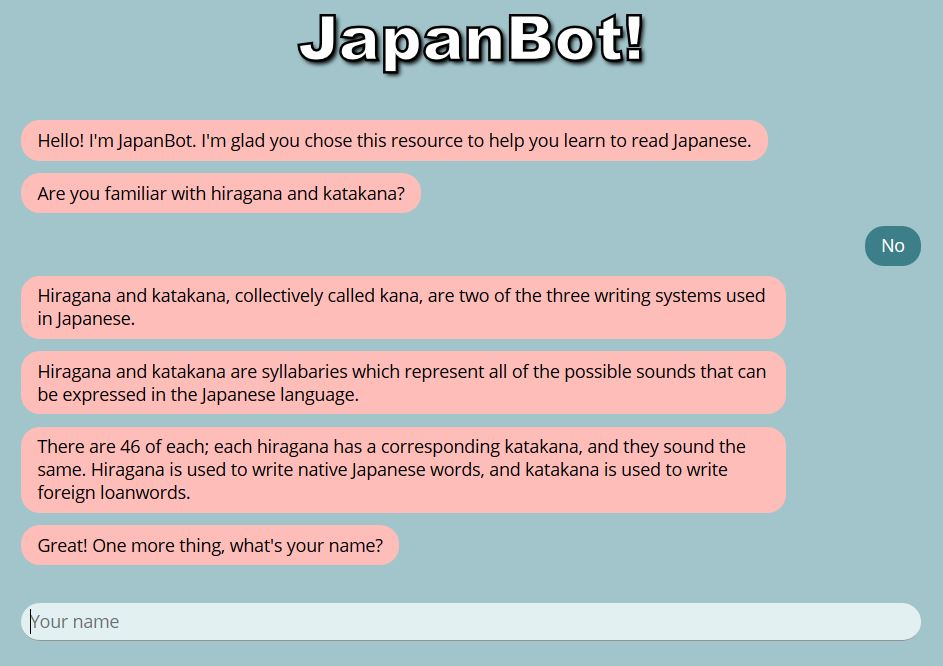
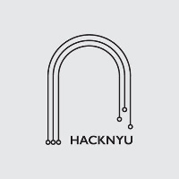

# HackNYU 2018  -  Japanese Chatbot

### Summary

JapanBot is a chatbot meant to teach Japanese language beginners the
basics of hiragana and katakana, and allow them to read a significant
amount of Japanese, and write any Japanese word that they learn
in a way which can be understood by every Japanese speaker.

### Motivation

JapanBot exists to provide a simple and user-friendly method of learning the kana syllabaries that is more than rote memorization. Users learn using spaced repetition at a managed pace, designed to make remembering easy.

### Screenshots

### Built With:

BotUI and NodeJS.

### Credits

Steve Kraft https://github.com/steven-kraft

Noah Eng https://github.com/noaheng

Sean Hill https://github.com/seanwhill

Josh Coneby https://github.com/jmconeby

Made at HackNYU 2018

